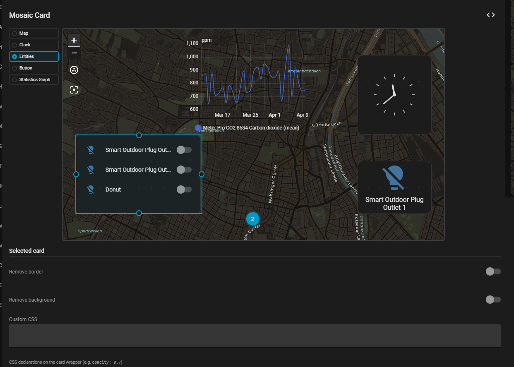

# Mosaic Card

A custom [Home Assistant](https://www.home-assistant.io/) Lovelace card that arranges sub-cards in a CSS Grid mosaic layout with full visual editor support. Build arbitrary layouts with drag and drop. Easily disable card backgrounds or borders and add custom css.

[](https://github.com/hacs/integration)
[](LICENSE)



## Features

- **CSS Grid layout** — place multiple cards in a freely configurable grid
- **Auto mode** — CSS `grid-auto-flow: dense` packs cards automatically
- **Manual mode** — explicit `column_start` / `row_start` for overlapping layouts
- **Visual editor** — live preview with drag-to-resize grid handles per card
- **Card picker** — add and remove sub-cards directly in the editor
- **Per-card options** — remove borders, remove background, custom CSS declarations

## Installation

### HACS (Recommended)

1. Open **HACS** in Home Assistant → **Frontend**
2. Click the three-dot menu → **Custom repositories**
3. Add `https://github.com/Liquidmasl/lovelace-mosaic-card` with category **Lovelace**
4. Search for **Mosaic Card** and click **Download**
5. Hard-refresh your browser (`Ctrl+Shift+R`)

### Manual

1. Download `mosaic-card.js` from the [latest release](https://github.com/Liquidmasl/lovelace-mosaic-card/releases/latest)
2. Copy to `<config>/www/mosaic-card.js`
3. Add as a Lovelace resource: **Settings → Dashboards → Resources** → `/local/mosaic-card.js` (type: JavaScript module)
4. Hard-refresh your browser

## Usage

Add via the UI card picker, or paste YAML directly into the card editor:

```yaml
type: custom:mosaic-card
mode: auto
rows: 4
column_gap: 8
row_gap: 8
cards:
  - type: tile
    entity: light.living_room
    grid_options:
      columns: 6
      rows: 2
  - type: tile
    entity: sensor.temperature
    grid_options:
      columns: 6
      rows: 2
  - type: tile
    entity: sensor.humidity
    grid_options:
      columns: 4
      rows: 2
  - type: tile
    entity: sensor.power
    grid_options:
      columns: 4
      rows: 2
  - type: tile
    entity: media_player.living_room
    grid_options:
      columns: 4
      rows: 2
```

### Manual mode (overlapping cards)

```yaml
type: custom:mosaic-card
mode: manual
rows: 4
cards:
  - type: picture
    image: /local/background.jpg
    grid_options:
      columns: 12
      rows: 4
      column_start: 1
      row_start: 1
      no_border: true
      no_background: true
  - type: tile
    entity: light.living_room
    grid_options:
      columns: 4
      rows: 2
      column_start: 1
      row_start: 3
      z_index: 1
```

## Configuration

### Card options

| Option | Type | Default | Description |
|---|---|---|---|
| `type` | string | **required** | `custom:mosaic-card` |
| `mode` | `auto` \| `manual` | `auto` | Layout mode |
| `rows` | number | `8` | Number of grid rows |
| `columns` | number | `12` | Number of grid columns (overridden by HA Layout tab) |
| `column_gap` | number | `8` | Gap between columns (px) |
| `row_gap` | number | `8` | Gap between rows (px) |
| `auto_flow` | `dense` \| `row` \| `column` | `dense` | CSS `grid-auto-flow` (auto mode only) |
| `title` | string | — | Optional title above the grid |
| `strip_borders` | boolean | `true` | Remove box-shadow / border-radius from sub-cards |
| `cards` | list | `[]` | Sub-card configurations |

### Sub-card `grid_options`

| Option | Type | Default | Description |
|---|---|---|---|
| `columns` | number | `2` | Column span |
| `rows` | number | `1` | Row span |
| `column_start` | number | — | Column start (manual mode) |
| `row_start` | number | — | Row start (manual mode) |
| `z_index` | number | — | Z-index for overlay stacking (manual mode) |
| `no_border` | boolean | `false` | Remove card border (box-shadow + border-radius) |
| `no_background` | boolean | `false` | Remove card background |
| `custom_css` | string | — | Extra CSS declarations on the card wrapper |

## Visual Editor

The Mosaic Card ships with a full visual editor accessible from the HA dashboard edit mode:

- **Live preview** — shows the mosaic layout at scale as you configure it
- **Drag handles** — resize and reposition each card directly on the preview
- **Card sidebar** — click a card in the sidebar to select it and edit its grid position
- **Layout section** — set mode, rows, and gap values
- **Cards section** — add, remove, and reorder sub-cards via the built-in card picker

## License

[MIT](LICENSE)
